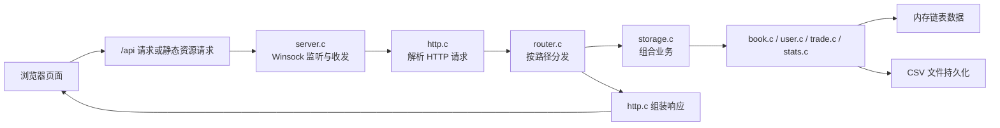

# 校园二手书交易管理系统

## 1. 项目概述

本项目是一个基于 C 语言实现的校园二手书交易管理系统，后端使用 `Winsock + 原生 HTTP + CSV 文件持久化`，前端使用 `HTML + CSS + JavaScript` 实现页面交互。系统面向课程设计或综合大作业场景，重点展示了“底层网络编程 + 数据结构 + 文件存储 + Web 前后端交互”的完整闭环。

项目的核心目标是让学生能够在浏览器中完成二手书交易的基础流程，包括：

- 用户注册与登录
- 图书发布
- 图书查询
- 按书名、作者、ISBN、分类、状态、价格筛选图书
- 购买图书
- 下架图书
- 查看个人购买记录
- 查看站内统计信息与分类成交情况

这个项目不是依赖现成 Web 框架搭建的，而是从 Socket 监听、HTTP 请求解析、路由分发，到业务处理和文件持久化，全部由 C 代码自行实现，因此非常适合用来答辩展示“底层原理”和“手写实现能力”。

## 2. 技术栈与特点

- 开发语言：C
- 平台：Windows
- 网络库：Winsock2
- 数据存储：CSV 文件
- 前端：原生 HTML / CSS / JavaScript
- 运行方式：本地 HTTP 服务器 + 浏览器访问

项目特点：

- 不依赖数据库，部署简单，适合课程项目演示
- 不依赖第三方 Web 框架，HTTP 请求和响应由代码手动处理
- 采用链表管理内存中的用户、图书、交易数据
- 每次业务操作后立即回写 CSV，保证数据持久化
- 页面和后端接口分离，浏览器通过 `/api/...` 调用后端

## 3. 功能与架构

### 3.1 功能模块

- 用户模块：注册、登录、会话创建、用户信息保存
- 图书模块：发布、查询、筛选、购买、下架、统计
- 交易模块：成交记录生成、查询、金额统计
- 统计模块：站内图书数量、成交额、分类成交分析
- 路由模块：根据请求路径分发到不同业务接口
- HTTP 模块：解析请求报文、组装响应报文、返回静态文件
- 存储模块：负责从 CSV 加载数据、保存数据、组织跨模块业务

### 3.2 系统运行流程



### 3.3 启动后的工作过程

1. `main.c` 启动程序，初始化 `AppData`
2. `storage_load_all()` 从 `data/*.csv` 加载用户、图书、交易记录到链表
3. `server_start()` 启动 Winsock HTTP 服务器并监听 `127.0.0.1:8080`
4. 浏览器访问页面后，后端先返回 `web/` 下的静态文件
5. 前端通过 `fetch` 调用 `/api/login`、`/api/books`、`/api/trades`、`/api/stats` 等接口
6. 业务成功后，后端立即把最新数据写回 CSV

## 4. 目录结构

```text
biggggggg homework!
├─ .vscode/         VS Code 相关配置
├─ build/           编译输出目录
├─ data/            CSV 数据文件
├─ src/             C 语言后端源代码
├─ web/             前端静态页面与脚本
└─ start.bat        Windows 启动脚本
```

## 5. 每个文件的作用

### 5.1 根目录与 VS Code 配置

| 文件 | 作用 |
| --- | --- |
| `start.bat` | Windows 下的一键启动脚本，检查可执行文件、数据目录和端口占用，自动打开浏览器。 |

### 5.2 `src/` 后端源码文件

| 文件 | 作用 |
| --- | --- |
| `src/main.c` | 程序入口，负责加载数据、打印启动信息、初始化存储，并按“读取 CSV -> 配置路由 -> 启动 HTTP 服务”的顺序启动后端。 |
| `src/server.h` | HTTP 服务器配置结构、默认端口、回调类型等声明。 |
| `src/server.c` | 基于 Winsock 的 TCP/HTTP 服务器实现，负责 `socket/bind/listen/accept/recv/send`。 |
| `src/http.h` | HTTP 请求与响应结构体声明，例如 `HttpRequest`、`HttpResponse`。 |
| `src/http.c` | 解析 HTTP 报文、读取 Query/Form 参数、拼装响应头、返回 JSON/HTML/文件。 |
| `src/router.h` | 路由分发层声明，定义静态资源根目录 `web`，暴露 `router_handle()`。 |
| `src/router.c` | 所有 API 的总入口，负责把 `/api/...` 请求映射到登录、注册、图书、交易、统计等业务。 |
| `src/storage.h` | 运行时总数据结构 `AppData` 的定义，以及组合业务接口声明。 |
| `src/storage.c` | 负责装配跨模块业务，例如“买书时同时改图书状态、生成交易记录、保存两个 CSV”。 |
| `src/book.h` | 图书结构 `Book`、查询条件 `BookQuery`、统计结构 `BookStats` 和图书模块接口声明。 |
| `src/book.c` | 图书链表管理、发布/购买/下架、按书名/作者/ISBN 等查询、CSV 读写。 |
| `src/user.h` | 用户结构、会话结构、角色枚举、用户模块接口声明。 |
| `src/user.c` | 注册、登录、密码校验、用户链表、会话 token、用户 CSV 读写。 |
| `src/trade.h` | 交易记录结构、查询结构、统计结构以及交易模块接口声明。 |
| `src/trade.c` | 生成交易记录、交易查询、金额统计、交易 CSV 读写。 |
| `src/stats.h` | 系统统计结构 `SystemStats` 和分类统计结构声明。 |
| `src/stats.c` | 计算用户数、图书状态数量、分类成交数、成交金额，并生成 `/api/stats` 用的 JSON。 |
| `src/utils.h` | 字符串、时间、URL、JSON、路径、MIME 等通用工具函数声明。 |
| `src/utils.c` | 提供大小写无关比较、URL 编解码、Query 解析、JSON 转义、文件类型识别等工具。 |

说明：

- `*.h` 文件主要负责结构体、宏、函数声明
- `*.c` 文件主要负责具体逻辑实现
- 模块之间通过头文件解耦，便于维护和扩展

### 5.3 `web/` 前端页面文件

| 文件 | 作用 |
| --- | --- |
| `web/index.html` | 主页面，包含图书查询、发布图书、统计面板、购买记录表格。 |
| `web/login.html` | 登录页，包含登录表单和欢迎背景图。 |
| `web/register.html` | 注册页，提交学号、姓名、密码、电话、邮箱。 |
| `web/css/style.css` | 主站统一样式文件，定义布局、表格、按钮、统计面板等样式。 |
| `web/js/api.js` | 前端通用请求封装，负责 `GET/POST` 请求、解析 JSON、管理本地会话信息。 |
| `web/js/auth.js` | 处理登录页和注册页的表单提交逻辑。 |
| `web/js/books.js` | 处理主页面的数据加载、图书渲染、按作者/ISBN/书名筛选、购买、下架、统计刷新。 |

### 5.4 `data/` 数据文件

| 文件 | 作用 |
| --- | --- |
| `data/books.csv` | 保存图书信息，包括书名、ISBN、作者、分类、价格、卖家、状态、发布时间等。 |
| `data/users.csv` | 保存用户信息，包括学号、姓名、密码哈希、联系方式、角色、注册时间等。 |
| `data/trades.csv` | 保存成交记录，包括交易号、图书号、买家、卖家、金额、时间、状态。 |

### 5.5 `build/` 构建产物

| 文件 | 作用 |
| --- | --- |
| `build/CampusBookTrade.exe` | 最终生成的可执行程序，运行后启动本地 HTTP 服务器。 |
| `build/book.o` | `src/book.c` 编译后的目标文件。 |
| `build/http.o` | `src/http.c` 编译后的目标文件。 |
| `build/router.o` | `src/router.c` 编译后的目标文件。 |
| `build/server.o` | `src/server.c` 编译后的目标文件。 |
| `build/stats.o` | `src/stats.c` 编译后的目标文件。 |
| `build/storage.o` | `src/storage.c` 编译后的目标文件。 |
| `build/trade.o` | `src/trade.c` 编译后的目标文件。 |
| `build/user.o` | `src/user.c` 编译后的目标文件。 |
| `build/utils.o` | `src/utils.c` 编译后的目标文件。 |

说明：

- `build/` 属于生成目录，不是手写源码目录
- 如果重新编译，这些文件可能会被新版本覆盖

## 6. 项目构建过程

### 6.1 构建环境

建议环境如下：

- 操作系统：Windows
- 编译器：MSYS2 / MinGW64 GCC
- 浏览器：Edge、Chrome、Firefox 均可

项目当前 VS Code 配置中使用的编译器路径为：

```text
C:/msys64/mingw64/bin/gcc.exe
```

### 6.2 从源码编译

在项目根目录下执行：

```powershell
gcc -Wall -Wextra -Wpedantic -Isrc src/main.c src/server.c src/http.c src/router.c src/storage.c src/book.c src/user.c src/trade.c src/stats.c src/utils.c -lws2_32 -o build/CampusBookTrade.exe
```

说明：

- `-Isrc`：告诉编译器头文件在 `src/` 目录
- `-lws2_32`：链接 Windows Socket 库
- 输出文件为 `build/CampusBookTrade.exe`

### 6.3 运行项目

方式一：直接运行可执行文件

```powershell
.\build\CampusBookTrade.exe
```

方式二：使用启动脚本

```powershell
.\start.bat
```

`start.bat` 会做这些事情：

- 检查 `build/CampusBookTrade.exe` 是否存在
- 检查 `data/` 和 `web/` 是否齐全
- 检查 `8080` 端口是否已被占用
- 自动打开浏览器访问登录页

启动成功后访问：

```text
http://127.0.0.1:8080/login.html
```

默认测试账号：

```text
student_id: 20260001
password:   123456
```

### 6.4 C 项目的构建原理

如果老师问“C 项目是怎么构建出来的”，可以这样回答：

1. 预处理：展开头文件、宏定义
2. 编译：把每个 `.c` 文件翻译成汇编或目标代码
3. 汇编：生成 `.o` 目标文件
4. 链接：把所有 `.o` 文件和系统库 `ws2_32` 链接成 `CampusBookTrade.exe`

本项目的 `build/*.o` 就是中间目标文件，`build/CampusBookTrade.exe` 是最终产物。

## 7. 数据与接口说明

### 7.1 数据组织方式

系统运行时的数据都在内存链表中：

- 用户链表：`User`
- 图书链表：`Book`
- 交易链表：`Trade`
- 会话链表：`UserSession`

程序启动时把 CSV 文件读入链表，程序运行时所有查询和修改都基于链表完成。操作成功后，再把链表写回 CSV。

这种设计的优点是：

- 结构清晰
- 不依赖数据库
- 适合小规模课程项目

代价是：

- 查询复杂度通常是 `O(n)`
- 并发能力有限
- 数据规模大时效率不如数据库

### 7.2 主要接口

| 接口 | 方法 | 作用 |
| --- | --- | --- |
| `/api/login` | POST | 用户登录 |
| `/api/register` | POST | 用户注册 |
| `/api/me` | GET | 根据 token 获取当前用户 |
| `/api/logout` | POST | 退出登录 |
| `/api/books` | GET | 查询图书 |
| `/api/books` | POST | 发布图书 |
| `/api/books/buy` | POST | 购买图书 |
| `/api/books/remove` | POST | 下架图书 |
| `/api/trades` | GET | 查询交易记录 |
| `/api/stats` | GET | 获取系统统计信息 |

### 7.3 图书查询支持的条件

`GET /api/books` 当前支持：

- `keyword`：书名关键字
- `author`：作者
- `isbn`：ISBN
- `publisher`：出版社
- `category`：分类
- `seller_id`：卖家学号
- `status`：在售 / 已售 / 已下架
- `min_price`：最低价
- `max_price`：最高价

这也是系统现在能够支持“按作者查找图书”和“按 ISBN 查找图书”的原因。

## 8. 答辩可能需要的背景知识

### 8.1 Winsock 与 Socket 服务器

本项目不是用 Tomcat、Nginx 或 Flask，而是自己写了一个最基础的 HTTP 服务器。核心过程是：

- `socket()` 创建套接字
- `bind()` 绑定地址和端口
- `listen()` 开始监听
- `accept()` 接收客户端连接
- `recv()` 接收浏览器发来的 HTTP 请求
- `send()` 把 HTTP 响应返回给浏览器

你可以把这个项目理解为“C 语言手写的迷你 Web 服务器”。

### 8.2 HTTP 请求与响应

浏览器访问页面时，底层其实是在发送 HTTP 报文。项目自己解析了：

- 请求方法：`GET`、`POST`
- 路径：例如 `/api/books`
- Query 参数：例如 `?author=同济`
- 表单参数：例如登录表单中的学号和密码

响应时也手动拼接了：

- 状态码：`200`、`400`、`404`、`500`
- 响应头：`Content-Type`、`Content-Length`
- 响应体：JSON、HTML、CSS、JS 或图片等

### 8.3 路由分发

后端采用“按路径分发”的设计：

- `server.c` 只负责收发网络数据
- `http.c` 只负责 HTTP 报文解析与封装
- `router.c` 负责看路径并决定调用哪个业务函数

这样分层的好处是职责清晰，后续增加新接口时只需要：

1. 在 `router.c` 新增路由
2. 调用相应业务模块
3. 返回 JSON

### 8.4 链表与时间复杂度

系统使用单向链表保存全部对象，这在课程设计里很常见。

优点：

- 插入节点方便
- 删除节点方便
- 适合手写数据结构练习

缺点：

- 按编号查找、筛选查询需要遍历，复杂度一般是 `O(n)`
- 不适合大规模高频查询

本项目中：

- 查找图书：通常是 `O(n)`
- 注册用户查重：通常是 `O(n)`
- 统计计算：通常是 `O(n)`

因为课程项目数据规模较小，所以这个选择是合理的。

### 8.5 CSV 持久化

本项目没有使用 MySQL，而是使用 CSV 文件保存数据。

优点：

- 简单直观
- 便于老师直接查看数据
- 方便调试

缺点：

- 不适合高并发
- 不支持复杂事务
- 需要自己处理 CSV 解析、转义和写回

项目中已经手写了 CSV 读写逻辑，支持带引号、逗号等字段处理。

### 8.6 用户认证与会话

登录流程可以这样讲：

1. 用户在前端输入学号和密码
2. 后端读取 `users.csv` 对应用户
3. 将输入密码做哈希后与存储值比较
4. 登录成功则创建 `UserSession`
5. 前端把返回的 `token/student_id/name` 保存到 `localStorage`

需要注意：

- 当前密码哈希使用的是简化版 `FNV-1a`，适合教学演示，不适合真实生产环境
- 当前 Session 存在内存链表中，服务器一重启就会丢失

### 8.7 统计模块

统计模块会扫描图书链表和交易链表，计算：

- 用户总数
- 图书总数
- 在售、已售、已下架数量
- 成交总金额
- 各分类上架量、成交量、成交额

这些结果会被转成 JSON，前端再渲染为统计卡片和分类进度条。

## 9. 答辩时可能被问到的问题

### 9.1 为什么选择 CSV 而不是数据库？

可以回答：

> 因为这个项目的重点是练习 C 语言、数据结构、Socket 和 HTTP 原理，而不是数据库运维。CSV 对课程设计来说实现成本低、结果直观、便于演示，适合小规模数据场景。

### 9.2 为什么选择链表而不是数组？

可以回答：

> 链表更适合频繁插入和删除，也符合课程中动态数据结构的训练目标。虽然查询效率不如索引结构，但本项目数据量小，遍历成本可接受。

### 9.3 图书购买后，如何保证交易记录同步生成？

可以回答：

> 购买逻辑不是只改图书状态，而是通过 `storage_buy_book()` 这个组合业务函数统一完成：先调用图书模块把图书设为已售，再根据图书信息生成交易记录，最后同时保存 `books.csv` 和 `trades.csv`。

### 9.4 按作者和按 ISBN 查询是怎么实现的？

可以回答：

> 后端本身就有 `BookQuery` 查询结构，`router.c` 会从 QueryString 中读取 `author` 和 `isbn` 参数，`book_matches_query()` 再用模糊匹配或字段匹配来判断图书是否满足条件。前端只需要把筛选项提交给 `/api/books` 即可。

### 9.5 页面为什么能直接访问 `index.html`、`css`、`js`？

可以回答：

> 因为后端不仅处理 API，也处理静态文件请求。`router.c` 对非 `/api/` 路径会映射到 `web/` 目录，再由 `http_response_file()` 把文件内容和 MIME 类型返回给浏览器。

### 9.6 为什么说它是前后端分离但又不是完全分离？

可以回答：

> 页面和后端接口在逻辑上是分离的，前端通过 `fetch` 调用接口；但它们仍由同一个 C 程序统一提供，所以属于“轻量级前后端分离”。

### 9.7 这个项目有哪些局限？

可以回答：

> 它是单线程阻塞式服务器，性能有限；CSV 不适合大数据和并发；会话仅保存在内存；密码哈希强度不够；部分业务接口主要依赖前端传入的学号参数，安全性还可以继续增强。

## 10. 已知局限与可改进方向

如果老师问“下一步怎么优化”，可以从下面几个方向答：

- 把单线程服务器改成多线程或线程池，提高并发能力
- 用 SQLite / MySQL 替换 CSV，提高查询和持久化能力
- 用更安全的密码哈希算法，例如 bcrypt / Argon2
- 对发布、购买、下架等接口增加 token 校验，防止伪造身份
- 为图书和用户建立哈希表或索引结构，降低查询复杂度
- 增加管理员后台、图书编辑、模糊排序、分页查询等功能
- 把 Session 落盘或改成更完整的认证机制

## 11. 使用与演示建议

- 建议先展示登录页，再用测试账号进入系统
- 先演示图书查询，再演示发布、购买、下架
- 最后展示统计面板和 `data/*.csv` 的变化，能很好体现“操作影响了后端数据”
- 如果答辩老师更关注底层，可以重点讲 Socket、HTTP 解析、路由分层、CSV 持久化
- 如果答辩老师更关注软件工程，可以重点讲模块拆分、职责分离、可扩展性和局限改进

## 12. 补充说明

- 登录页背景图来自外部网络地址，如果离线环境下图片加载失败，不影响登录和系统主功能
- 当前系统适合教学、演示、课程设计，不建议直接作为生产系统使用
